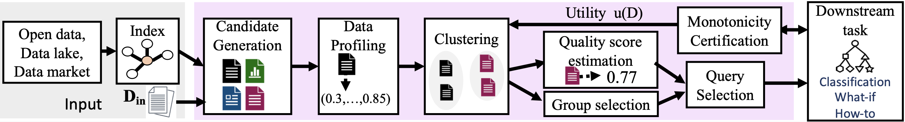

# Metam: Goal-Oriented Data Discovery

Metam is the public implementation of the **M**odel-driven **E**xploration of **T**ables for **A**ugmenting **M**odels (METAM) framework introduced in the paper *“METAM: Goal-Oriented Data Discovery”* (Galhotra, Gong, Castro Fernandez. arXiv:2304.09068).  
The system takes an input dataset, learns how augmentation candidates affect a downstream task, and automatically recommends those that increase utility.

---

## Why Goal-Oriented Discovery?

- **Task-aware feedback loop.** Rather than searching for tables once, METAM repeatedly augments the task input and observes the change in utility, forming an interventional loop that keeps discovery aligned with the end goal.
- **Structured exploration.** Candidate join paths are profiled (semantic similarity, correlation, coverage, mutual information, etc.), clustered, and then explored via sequential and Thompson-sampled group querying.
- **Anytime guarantees.** The algorithm prioritizes the most promising augmentations, delivers intermediate results quickly, and improves them as more queries are allowed.

> ✨ For background and theoretical guarantees see the [paper](https://arxiv.org/abs/2304.09068).

---

## Architecture at a Glance



1. **Candidate generation / profiling** — ingest join paths (e.g., from [Aurum Data Discovery](https://github.com/mitdbg/aurum-datadiscovery)), compute task-independent profiles for every augmentable column.
2. **Clustering & scoring** — cluster similar candidates with k-center, seed sequential scorers (ClusterBalance / ProfileWeighting).
3. **Interventional querying** — sequential queries evaluate a single augmentation; group queries sample multiple columns per Thompson sampling.
4. **Result streaming** — utilities and augmentation decisions stream back to the UI or CLI via Server Sent Events (SSE).

---

## Repository Tour

| Path | Description |
| --- | --- |
| `api2/` | Flask REST backend for uploads, configuration, utility scoring, METAM orchestration, and SSE streaming. |
| `metam/` | Core Python pipeline (config, pipeline orchestration, shared dataclasses). |
| `src/backend/` | Algorithms for profiling, clustering, scoring, querying, and ML models. |
| `src/` | React application (upload wizard, variant builder, dashboards). |
| `cli/` | Command-line runner, sample data (`cli/data`), and variant templates. |
| `data/`, `aurum_model/`, `datajoinpath/` | Example Favorita datasets, Aurum indexes/config, utilities to reproduce experiments. |

---

## Prerequisites

- **Python** ≥ 3.9 with `pip`.
- **Node.js** ≥ 18 and **yarn** for the frontend.
- **Aurum index** (optional but required for large-scale discovery). Generate join paths via Aurum and drop them under `datajoinpath/` or upload them through the UI.
- **Optional NLP profiler dependencies** – the `SemanticProfile` loads `sentence-transformers/all-MiniLM-L6-v2` via `torch` and `transformers`. Install them if you enable that profiler.

> 📁 Sample data, join-path CSVs, and directories mimicking the upload flow live under `cli/data/`. They are perfect for a dry run.

---

## Shared Backend Setup

```bash
# from the repo root
python -m venv venv
source venv/bin/activate          # Windows: venv\Scripts\activate
pip install --upgrade pip
pip install -r requirements.txt   # add torch/transformers if SemanticProfile is used

# make repo modules importable
export PYTHONPATH="$PWD"

# point Flask to the API package and start the server
export FLASK_APP=api2.app
export FLASK_ENV=development       # optional for auto reload
flask run                          # serves http://127.0.0.1:5000
```

This single backend supports both the GUI and CLI workflows. Uploaded files are stored under `api2/uploads/<job_id>/`.

---

## GUI Workflow (React App)

1. **Install dependencies**
   ```bash
   yarn install
   ```
2. **Start the dev server**
   ```bash
   yarn start
   ```
   The React app proxies `/api/*` calls to `http://127.0.0.1:5000` (configurable in `src/setupProxy.js`). Visit [http://localhost:3000](http://localhost:3000).

3. **Interact**
   - Upload a CSV — the backend assigns a `job_id`, stores the file, and returns a preview.
   - (Optional) Click **Prepare Dataset** to drop rows with missing values (see `api2/services/preprocessor.py`).
   - Configure one or more **variants**: select a task (`classification`, `regression`, what-if/causal placeholders), target attribute, metric, sequential scorer, group query helper, and profiler subset.
   - Upload **join-path** CSVs or an auxiliary **folder** of datasets if you have them. Otherwise, try the bundled Favorita data.
   - Navigate to **Task Output** to compute per-variant baseline utility via `/api/utility`.
   - Click **Identify useful augmentations** to stream METAM progress on the **Results** page (Recharts overlays, augmentation logs, SSE-driven status).

4. **Inspect** – the experimental *Inspect* and *Provenance* tabs demonstrate future directions (causal narratives, provenance views). Their APIs are not finalized yet.

Run `yarn test`, `yarn build`, or `yarn eject` as you would with any Create React App project.

---

## CLI Workflow (Headless Experiments)

The CLI mirrors the GUI flow but pulls inputs from disk and streams progress to stdout.

```bash
source venv/bin/activate

# quick start using the bundled Favorita sample
python -m cli.run_variants \
  --query-path   cli/data/dataset_file/train.csv \
  --data-dir     cli/data/folder \
  --join-path    cli/data/joinpath/join_paths.csv \
  --variants     cli/variants.json \
  --output-dir   cli/data/outputs \
  --summary-json cli/data/outputs/summary.json
```

Key files:

- `cli/variants.json` — list of variants (task, metric, attribute, query helper, quality scorer, profiler whitelist). This is the same schema the UI sends to `/api/metam/start`.
- `cli/run_variants.py` — spins one worker thread per variant, feeds progress through `metam.pipeline.run_metam`, and writes each augmented dataset to `<output-dir>`.

Override any of the CLI arguments to point at your own data lake, Aurum join-path output, or experiment folder.

---

## Data & Aurum Integration

1. **Generate join paths** using [Aurum Data Discovery](https://github.com/mitdbg/aurum-datadiscovery).  
   The provided `datajoinpath/sources.yml` shows how to register the Favorita CSV directory with Aurum’s ingestor.
2. **Export** the resulting join-path CSVs (columns: `tbl1,col1,tbl2,col2`), then either place them under `cli/data/joinpath/` or upload them in the UI.
3. **Upload auxiliary tables** as a folder (the UI automatically prefixes them) or point the CLI `--data-dir` to the containing directory. METAM expects filenames to match the table names referenced in the join-path file.

If you do not have an Aurum index yet, you can still experiment with the provided sample join-paths and the dummy upload folder.

---

## Configuration Reference

- **Variants** – Each variant encapsulates a task hypothesis:
  - `task`: `"classification"`, `"regression"`, or placeholder strings for causal workflows.
  - `attribute`: target column in the uploaded CSV.
  - `metric`: e.g. `"accuracy"`, `"recall"`, `"f1"`, `"mse"`, `"r2"`.
  - `queryMethod`: one of the helpers in `Config.SHARED_GRP_HELPER_LIST` (default `identify_group_query_thompson`).
  - `qualityScorers`: sequential scorer (`ClusterBalanceScorer` or `ProfileWeightScorer`).
  - `profilers`: subset of profilers from `Config.SHARED_PROFILER_LIST`.
- **Global options** — `/api/config/options` exposes the above enums so the UI can render dropdowns dynamically.
- **Runtime knobs** — tune `metam/config.py` (epsilon radius, stopping criteria, random seed, etc.) or pass overrides programmatically via the CLI runner.

---

## Tips for Reproducibility

- **Python path** – export `PYTHONPATH` (or use `pip install -e .`) so the API can import `metam` and `src/backend`.
- **Caching embeddings** – when using `SemanticProfile`, run it once to download the `sentence-transformers` weights under `~/.cache/huggingface/`.
- **Persisting jobs** – uploads live in `api2/uploads/<job_id>/{dataset_file,joinpath,folder,config}/`. You can inspect or reuse them between runs.
- **Testing hooks** – `yarn test` exercises the React UI; CLI runs double as integration tests for the backend pipeline.

---

## Citing METAM

```text
@article{galhotra2023metam,
  title   = {METAM: Goal-Oriented Data Discovery},
  author  = {Galhotra, Sainyam and Gong, Yue and Castro Fernandez, Raul},
  journal = {arXiv preprint arXiv:2304.09068},
  year    = {2023}
}
```

Have questions or ideas? Feel free to open an issue, and please reference the variant/task you are running along with relevant logs (`api2/app.log`, CLI summary) so we can help quickly.
